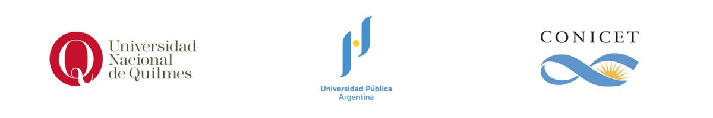

[![CC BY-SA 4.0][cc-by-sa-shield]][cc-by-sa]

# Bioinfo_UNQ

This work is licensed under a
[Creative Commons Attribution-ShareAlike 4.0 International License][cc-by-sa].

[![CC BY-SA 4.0][cc-by-sa-image]][cc-by-sa]

[cc-by-sa]: http://creativecommons.org/licenses/by-sa/4.0/
[cc-by-sa-image]: https://licensebuttons.net/l/by-sa/4.0/88x31.png
[cc-by-sa-shield]: https://img.shields.io/badge/License-CC%20BY--SA%204.0-lightgrey.svg

# Bioinfo_UNQ
Este material está diseñado para el contexto de trabajo aúlico de la cátedra de Bioinformática de las carreras Tecnicatura en Programación Informática y Licenciatura Informática de la Universidad Nacional de Quilmes. 

Podés encontrar material interactivo para estudiar alineamientos de secuencias en el siguiente enlace: [https://flbulgarelli.github.io/umi/#una-palabra-no-dice-nada-y-al-mismo-tiempo-lo-dice-todo](https://flbulgarelli.github.io/umi/#una-palabra-no-dice-nada-y-al-mismo-tiempo-lo-dice-todo)

## PANDAS:USOS Y DESUSOS
Esta actividad requiere la instalación de [Anaconda](https://www.anaconda.com/distribution/) y las librerías Pandas y seaborn (ver guía de instalación de Python)

## ALINEAMIENTO ESTRUCTURAL_VIZ 
Para el trabajo práctico de alineamientos estructurales utilizaremos el software Pymol (que puede ser instalado siguiendo el tutorial [https://pymolwiki.org/index.php/Linux_Install](https://pymolwiki.org/index.php/Linux_Install) )

## MODELADO 
Los trabajos prácticos relativos al modelado molecular requieren la instalación de Modeller ([ver tutorial de instalación](https://salilab.org/modeller/download_installation.html) ). Recomiendo la instalación utiizando conda en caso de tener instalado Anaconda como distribución de Python.

## OTROS RECURSOS
### Repositorios

| **Nombre** | **Url** | **Práctica** | **Pros** | **Contras** |
| ------------- | ------------- | ------------- | ------------- | ------------- |
|  Learn Genomics| [https://learngenomics.dev/](https://learngenomics.dev/) | 10% | De lectura rápida | En inglés, sin traducción. Práctica muy escasa, no profundiza los contenidos. Solo aborda contenidos de genómica y biología básica |
| Carpentries | [https://software-carpentry.org/lessons/](https://software-carpentry.org/lessons/) | 50 % | De lectura rápida. Bien explicado y con traducciones a muchos idiomas | Solo contenido de programación |
| Introduccioón a la Bioinformática | [https://github.com/AJVelezRueda/Introduccion_a_la_Bioinformatica](https://github.com/AJVelezRueda/Introduccion_a_la_Bioinformatica) | 50% | En español, con prácticas múltimples en diferentes temas | Contenido introductorio con foco en Bioinformática y no tanto en programación |
|Herramientas Bioinformáticas para el análisis de estructura, desorden e interacciones de proteínas| [https://bioinformatica-iib.github.io/estructural/contenidos/](https://bioinformatica-iib.github.io/estructural/contenidos/) | 50% | En español. Con teorías y prácticas detalladas | Requiere instalaciones. Solo de bioinformática estructural | Contendio variado |

### Libros

| **Nombre** | **Url** | **Práctica** | **Pros** | **Contras** |
| ------------- | ------------- | ------------- | ------------- | ------------- |
|  Bioinformática con ñ | [https://tess.elixir-europe.org/materials/bioinformatica-con-n](https://tess.elixr-europe.org/materials/bioinformatica-con-n) | 0% | Abarca múltiples temáticas en el área. En español. | Libre y Gratuito |
|  Python para Científicos | [https://pyciencia.taniquetil.com.ar/](https://pyciencia.taniquetil.com.ar/) | 0% | En español,con foco en temáticas importantes para el ámbito científico | Libre y Gratuito.  |