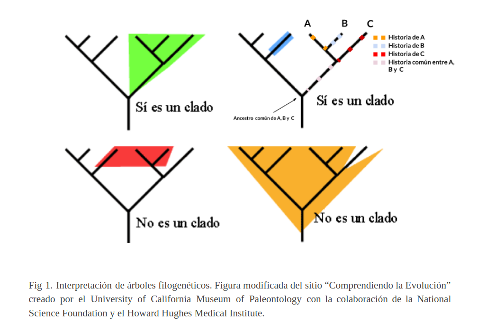

# Inferencias Evolutivas

##### Autores: Dra. Ana Julia Velez Rueda y Guillermo I. Benítez

### Indice
  * [1. Una distancia prudencial](#1_intro)
  * [2. Jardineros de la naturaleza](#2_arboles)
  * [3. Mesero!!! Hay una mosca en mi Bart!!](#3_bart)
  * [4. Bibliografía](#4_Bibliografia)

[1. Una distancia prudencial](#1_intro)

La historia de las especies y cómo estas han cambiado desde que se desarrollara la vida en la tierra, ha quedado registrada en los genomas de las especies actuales. Los estudios evolutivos permiten realizar inferencias estructurales y funcionales donde el conocimiento sobre los sistemas aún es insuficiente. Sin embargo, este tipo de inferencia, requiere de la estimación de distancias evolutivas entre especies, basadas en las diferencias  entre genes ortólogos. Como bien ya explicamos dos secuencias que comparten un ancestro común se denominan secuencias homólogas (Reeck et al., 1987), y las moléculas homólogas, u homólogos, se pueden dividir en dos clases: parálogos, que son homólogos que están presentes dentro de una especie y que suelen diferir en sus funciones bioquímicas detalladas; y ortólogos son homólogos que están presentes dentro de diferentes especies y tienen funciones muy similares o idénticas. 
Los árboles filogenéticos son algo así como el árbol genealógico de las especies, e implican una hipótesis sobre las relaciones que existen entre los organismos. Su confección requiere de ciertas métricas que tengan en cuenta el tiempo requerido para poder observar la divergencia de las secuencias (Kalyaanamoorthy et al. 2017). Una vez determinadas las distancias entre las secuencias, los distintos organismos pueden ser agrupados, utilizando distintos algoritmos de clustering. Debemos tener en cuenta que la construcción de árboles filogenéticos requiere de la utilización de caracteres que sean indicadores fiables de una ascendencia común. Genes distintos tienen tasas evolutivas distintas que dependen de la estructura y función de las proteı́nas que codifican (Bromham 2009), por lo que las secuencias que se seleccionen para el análisis deben ser informativas y representar la evolución de dichas especies.

[2. Jardineros de la naturaleza](#2_arboles)

Entender una filogenia es sencillo cuando lo comparamos con los árboles genealógicos, en los que la raíz representa el linaje ancestral y los extremos de las ramas representan los descendientes de ese antepasado. Al moverse desde la raíz a las puntas, nos movemos en el tiempo. Las filogenias siguen la pista a los patrones de ascendencia compartidos por los linajes, donde cada linaje tiene una parte de historia que es única y otras partes que son compartidas con otros linajes. Los nodos terminales (hojas) corresponden a las secuencias actuales (observadas), y los nodos internos representan sus ancestros hipotéticos (Ver Fig. 1). La longitud de las ramas refleja la cantidad de cambios acumulados. Los nodos relacionan estas ramas entre sí según su relación ancestro-descendiente. Podríamos definir grupos de organismos con un antepasado en común, al que denominamos clado. Un clado incluye, entonces, un antepasado común y todos los descendientes (vivos y extintos) de ese antepasado 

Es importante tener en cuenta en la interpretación de los árboles filogenéticos, que la evolución produce una estructura de relaciones entre los organismos, que no es una escalera donde los organismos “más evolucionados” o “superiores” se han diferenciado en su camino a una perfección última. Las inferencias evolutivas nos proponen relaciones entre las especies, que comparten características en común. Es también clave entender que sólo el alineamiento correcto produce inferencias filogenéticas correctas (Iantorno et al. 2014; Ashkenazy et al. 2019). Metodológicamente, el primer paso para construir un árbol filogenético es confeccionar un alineamiento de secuencias. Este es el paso más crítico del procedimiento debido a que éste establece las correspondencias posicionales en la evolución. Por lo tanto, es imprescindible confeccionar correctamente dichos alineamientos, con secuencias que sean suficientemente informativas (Deng et al. 2010;Townsend et al. 2008). 

[3. Mesero!!! Hay una mosca en mi Bart!!](#3_bart)

Hemos estado trabajando sobre algunos casos concretos de estudio en el trabajo práctico anterior. En particular trabajamos sobre alineamientos de secuencias de Cyt P450 de distintos organismos (podés descargar las secuencias con las que trabajamos desde [aquí](https://github.com/AJVelezRueda/Bioinfo_UNQ/blob/master/Trabajos_Practicos/Inferencias_evolutivas/SecuenciasCytocromoC.fasta)).
En esta ocasión trabajaremos sobre un gran misterio de la biología molecular: el caso del Humanomosca o Moscahumano.
Seguramente vieron en la tele el resonado caso del niño con cabeza de mosca de fruta y como bien sabemos la tele nunca miente ¿no?  Aún cuando se han realizado múltiples estudios que intentan darle una respuesta kafkiana a los padres, aún no se ha podido determinar cuánto de esta criatura conserva las características del niño. Para ello se secuenció el _Cyt P450_ del *niño_mosca* y se obtuvo la siguiente resultado:

>_>_ bartmosca
MGSGDAENGKKIFVQKCAQCHTYEVGGKHKTGPNLHGLFGRKTGQAPGYSYTAANKNKGIIWGEDTLMEYLENPKKYIPGTKMIFVGIKKKEERADLIAYLKKATNE
>
>🧗🏻‍♀️DESAFÍO I: Detalla las tácticas y/o metodologías que deberían utilizarse para darles una respuesta a los padres del niño. 
Dadas las secuencias de Mosca, humano y Moscahumano ¿Qué criterios se les ocurren para comparar las secuencias? ¿Qué resultados obtienen del análisis anterior?
¿Qué resultado esperaría obtener si utilizara el resto de las secuencias en el análisis? ¿Por qué? 
>
>🧗🏻‍♀️DESAFÍO II: Como vimos anteriormente existen algunos softwares optimizados para confeccionar alineamientos de secuencias. En particular hemos trabajado con [Clustal](https://www.ebi.ac.uk/Tools/msa/clustalo/) (Larkin et al. 2007). Confecciona los alineamientos para los del punto Ia y Ib análisis.
>
>🧗🏻‍♀️DESAFÍO III: Mediante el uso del servidor de [IQtree](http://iqtree.cibiv.univie.ac.at/) (Trifinopoulos et al. 2016), confecciona los árboles filogenéticos para los alineamientos obtenidos en el punto II.
Como vemos, el servidor nos permite elegir el modelo de sustitución ¿A qué se refiere?
¿Qué es el Bootstrap? ¿De qué manera nos habla de la calidad de nuestro árbol? ¿Cómo influye el número de Bootstraps en el resultado?
Interpreten los resultados obtenidos, mediante la visualización de los árboles con la herramienta [FigTree](http://tree.bio.ed.ac.uk/software/figtree/). ¿Es necesario realizar algún paso extra, previo a la interpretación del árbol? ¿Por qué? 
>

[4. Bibliografía](#4_Bibliografia)

Ashkenazy, H., Sela, I., Levy Karin, E., Landan, G. and Pupko, T. 2019. Multiple sequence alignment averaging improves phylogeny reconstruction. Systematic Biology 68(1), pp. 117–130.
Bromham, L. 2009. Why do species vary in their rate of molecular evolution? Biology Letters 5(3), pp. 401–404.
Deng, W., Maust, B.S., Nickle, D.C., et al. 2010. DIVEIN: a web server to analyze phylogenies, sequence divergence, diversity, and informative sites. Biotechniques 48(5), pp. 405–408.
Iantorno, S., Gori, K., Goldman, N., Gil, M. and Dessimoz, C. 2014. Who watches the watchmen? An appraisal of benchmarks for multiple sequence alignment. Methods in Molecular Biology 1079, pp. 59–73.
Kalyaanamoorthy, S., Minh, B.Q., Wong, T.K.F., von Haeseler, A. and Jermiin, L.S. 2017. ModelFinder: fast model selection for accurate phylogenetic estimates. Nature Methods 14(6), pp. 587–589.
Thompson, J.D., Higgins, D.G. and Gibson, T.J. 1994. CLUSTAL W: improving the sensitivity of progressive multiple sequence alignment through sequence weighting, position-specific gap penalties and weight matrix choice. Nucleic Acids Research 22(22), pp. 4673–4680.
Townsend, J.P., López-Giráldez, F. and Friedman, R. 2008. The phylogenetic informativeness of nucleotide and amino acid sequences for reconstructing the vertebrate tree. Journal of Molecular Evolution 67(5), pp. 437–447.

**Recursos Extra**

[The Cabbages of Doom](https://bit.ly/2Xb6ssL)

[Phylogentics: an introduction](https://bit.ly/3cdDvkn)