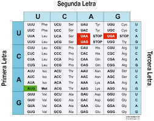

# Biomoléculas: una breve introducción al nuestro mundo interior

##### Autora: Dra. Ana Julia Velez Rueda

### Indice
  * [1.Por la célula](#1_intro)
  * [2.¡Abracadabra una PROTEÍNA!](#2_traduccion)

[1. Por la célula: ¡La causa y la solución de todos los problemas de la vida! 🍻](#1_intro)

En 1837 Theodor Schwann y Matthias Schleiden generalizaron la teoría celular, desde entonces sabemos que  todos los organismos vivos se encuentran organizados en células (Müller-Wille 2010). Existen dos tipos de células: procariotas y eucariotas. Hasta 1940 no se conocían diferencias entre los distintos tipos de células, no fue hasta 1960 que se adquirió conocimiento sobre la existencia del núcleo. En mamíferos, por ejemplo, existen aproximadamente 220 tipos distintos de células eucariotas. Las células procarióticas carecen de núcleos limitados por membrana y de la mayoría de las organelas que se encuentran en las células eucarióticas. Los procariotas fueron la única forma de vida sobre la Tierra durante casi 2.000 millones de años; después, hace aproximadamente 1.500 millones de años, aparecieron las células eucarióticas. Lynn Margulis, en 1970, provee las evidencias que sustentan la teoría endosimbiótica, que explica el origen de algunas organelas eucarióticas (Margulis and L. 1981). Si bien las diferencias estructurales entre las células eucariotas y procariotas parecen claras, desde el punto de vista genético las diferencias entre los tipos de células son más difusas. La célula eucariota pareciera ser quimera genética, en la que los genes “informacionales” tienen su origen en el reino archaea, mientras que los genes “operacionales” tienen su origen en el reino bacteria. 

>
>**PARA PENSAR** 🤔: ¿A qué se refiere el texto con la frase “los genes “informacionales” tienen su origen en el reino archaea, mientras que los genes “operacionales” tienen su origen en el reino bacteria”? 
>
>🧗🏻‍♀️**DESAFIO I**: Enumerá las diferencias que existen entre una célula procariota y eucariota.
>

[2.¡Abracadabra una PROTEÍNA!](#2_traduccion)

En eucariotas las secuencias de genes que codifican para una proteína no son continuas, sino que están interrumpidas por secuencias no codificantes. Las secuencias no codificadoras que producen interrupciones dentro de un gen se conocen como secuencias interpuestas o intrones, y las secuencias codificadoras, aquellas que se expresan, son llamadas exones. Los genes son secuencias de nucleótidos de ADN que codifican la información necesaria para la síntesis de proteínas. Las investigaciones de Beadle y Tatum en Neurosporas (Beadle and Tatum 1941) establecieron el dogma “un gen codifica para una proteína”. En 1958 Crick plantea el dogma central de la biología molecular, donde establece que el flujo de información va del ADN al ARN, y de éste a las proteínas, lo que permite adquirir evidencias moleculares de la evolución (Sustar 2007). 
La expresión génica es el proceso que permite obtener proteínas a partir de la información codificada en el ADN. Esta síntesis tiene lugar en dos pasos: transcripción y traducción que describiremos brevemente a continuación. La transcripción tiene lugar en el núcleo y en ella una de las dos hebras que conforman la doble cadena de ADN sirve de molde para que una secuencia concreta se copie a una molécula de ARN de cadena sencilla. Posteriormente, este ARN sale fuera del núcleo y lleva el mensaje (la secuencia de nucleótidos) hasta los ribosomas, de ahí el nombre de ARN mensajero (ARNm). 
La traducción es el proceso que ocurre en el citoplasma celular en el que la molécula de ARNm se decodifica (traduce) para generar una cadena específica de aminoácidos. La correspondencia existente entre la secuencia de nucleótidos del ARNm y los aminoácidos es lo que se denomina código genético. El código genético consiste, por lo tanto, en el sistema de tripletes de nucleótidos en el RNA (copiado a partir de DNA) que especifica el orden de los aminoácidos en una proteína. El código genético consiste en 64 combinaciones de tripletes (codones) y sus aminoácidos correspondientes. Los codones que se muestran aquí son los que puede presentar la molécula de mRNA. De los 64 codones, 61 especifican aminoácidos particulares. Los otros 3 codones son señales de detención, que determinan la finalización de la cadena.

>
>PARA PENSAR: ¿Cuáles de los pasos descritos anteriormente deberías cambiar si habláramos de células procariotas?  🤔
>
>🧗🏻‍♀️**DESAFIO II**: Dado el código genético como se muestra en la tabla:
>
>  
>
>
>Crea un script en Python que tome como argumento una secuencia proteica e imprima una cadena de ARN codificante.
>Podés usar de ejemplo el siguiente péptido (cadena corta de aminoácidos): 
>
>   Sec1: ‘ATVEKGGKHKTGPNEKGKKIFVQKCSQCHTVLHGLFGRKTGQA'
>
>
>🧗🏻‍♀️**DESAFIO III**: En muchos de los genes codificados en el ADN existe un motivo recurrente ubicado antes de la secuencia codificante del gen que direcciona la unión de la ARN Polimerasa II, la proteína encargada de copiar el ADN a un ARN mensajero. Ésta secuencia denominada caja TATA (consistente en una secuencia de nucleótidos 'TATAAA') se encuentra presente en lo que se denomina región promotora de diversos genes, en organismos de todos los reinos (Smale and Kadonaga 2003; Lifton et al. 1978)
>
>👉 Creá un script en Python que, tomando como input un archivo con una secuencia de ADN, permita identificar las regiones promotoras de un gen, considerando que tal región comienza y termina con la caja TATA.
>
>🧗🏻‍♀️**DESAFIO IV**: Vamos a divertirnos un poco mientras aprendemos, ¡y no hay mejor modo de hacer esto que jugando! 
>
> 👉 Diseñá un juego rpg interactivo sobre la expresión génica que se muestre en la consola (que se ejecute mediante CLI de manera similar a lo visto en el Bashaton). Tené en cuenta que lo vas a tener que compartir con la clase.
> 
>¡El cielo es límite, a divertirse! 

  
Bibliografía

Beadle, G.W. and Tatum, E.L. 1941. Genetic Control of Biochemical Reactions in Neurospora. Proceedings of the National Academy of Sciences of the United States of America 27(11), pp. 499–506.
Lifton, R.P., Goldberg, M.L., Karp, R.W. and Hogness, D.S. 1978. The organization of the histone genes in Drosophila melanogaster: functional and evolutionary implications. Cold Spring Harbor Symposia on Quantitative Biology 42 Pt 2, pp. 1047–1051.
Margulis and L. 1981. Symbiosis in cell evolution: Life and its environment on the early earth.
Müller-Wille, S. 2010. Cell theory, specificity, and reproduction, 1837-1870. Studies in history and philosophy of biological and biomedical sciences 41(3), pp. 225–231.
Smale, S.T. and Kadonaga, J.T. 2003. The RNA polymerase II core promoter. Annual Review of Biochemistry 72, pp. 449–479.
Sustar, P. 2007. Crick’s notion of genetic information and the “central dogma” of molecular biology. The British journal for the philosophy of science 58(1), pp. 13–24.

