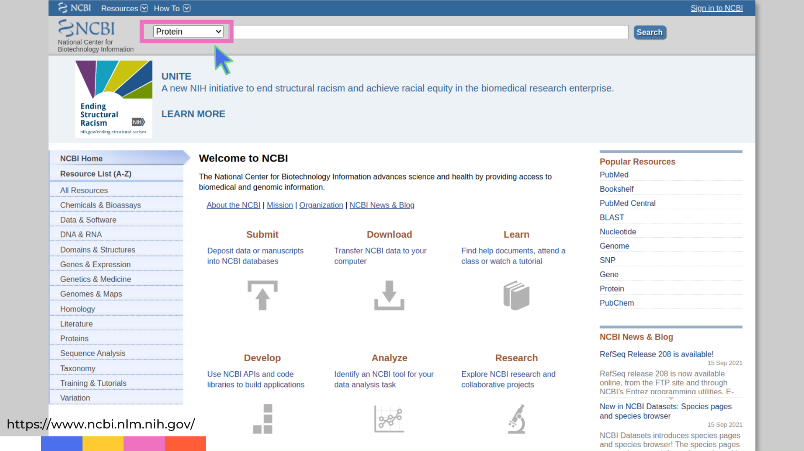
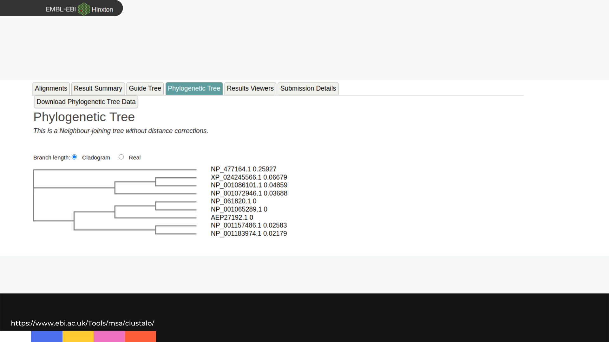

# ¿En qué se parecen una gallina y una mosca?

> Autora: Dra. Ana Julia Velez Rueda


El citocromo c es una proteína presente en la mayoría de los organismos e involucrada en la respiración aeróbica. En humanos y chimpancés está formado por los mismos 104 aminoácidos, ordenados exactamente igual. ¿Podríamos ver entonces qué relación guarda nuestra proteína con la de una mosca o un pollo, comparando sus secuencias? El primer paso para nuestra comparación entre organismos es buscar nuestras secuencias en las bases de datos. En el buscador general del NCBI [https://www.ncbi.nlm.nih.gov](https://www.ncbi.nlm.nih.gov) se pueden buscar, entre otras cosas, secuencias de ADN o proteínas. Como la comparación la haremos sobre la base de las proteínas de los organismos, debemos elegir en el menú desplegable la opción Protein; así estaremos indicando al buscador que acceda a la base de datos correspondientes a secuencias de proteínas.




Alternativamente, podríamos acceder en forma directa a la página web de NCBI Protein [https://www.ncbi.nlm.nih.gov/protein](https://www.ncbi.nlm.nih.gov/protein).

Si buscamos el término cytochrome c, obtendremos un listado de secuencias del citocromo c en múltiples organismos. Si quisiéramos acceder a una secuencia en particular, para verla en pantalla o guardarla en un archivo en nuestra computadora, deberíamos hacer clic en el ítem que nos interese del listado de resultados. Podemos usar los filtros disponibles en los menús laterales para facilitar la búsqueda del citocromo c en un organismo en particular. Como alternativa, podríamos realizar una nueva búsqueda en el buscador de la página pero agregando el nombre del organismo en el que estamos interesados.

- Ingresemos a la entrada correspondiente al citocromo c de Homo sapiens.


Al inspeccionar uno de los resultados de la búsqueda en detalle, observamos toda la información disponible acerca de la secuencia de esa proteína: de qué organismo proviene (ORGANISM), quiénes son los investigadores que la determinaron (_**AUTHORS**_), la referencia al artículo donde se publicó (_**TITLE, JOURNAL, PUBMED**_), algunas características de esa secuencia, etc. Al final de la página está la secuencia de aminoácidos de la proteína. 

Para conservar esta secuencia podríamos simplemente copiar, pegar y guardar la secuencia en un archivo de Word, el procesador de texto. Sin embargo, solemos trabajar con archivos de texto sencillos, que respetan un formato estandarizado llamado **FASTA**. Podemos usar el botón “enviar a” (**Send to**) en la parte superior de la página y elegir descargar un archivo (**File**) que contendrá la secuencia deseada en formato FASTA. 

Para tener con qué comparar a la proteína humana, el primer paso sería repetir la búsqueda para el pollo, la mosca y cada uno de los organismos que nos interesen.

Trabajaremos con las secuencias del citocromo c de nueve organismos, listados en la tabla de abajo. Además de su denominación taxonómica, deberíamos conocer su nombre común: intentemos completar la tabla.
Podríamos descargar las nueve secuencias a nuestra computadora, luego abrir cada archivo, copiar la secuencia y pegarla en un nuevo archivo que finalmente contendrá todas las secuencias descargadas. Para facilitar el trabajo en este curso, les proveemos un archivo que ya contiene las secuencias a comparar (pueden descargarlo desde [aquí](https://drive.google.com/file/d/1LVn72e1ru8Bf3HOA1sP29o_-kf1SmfP1/view?usp=sharing)).

| Secuencia	|Nombre taxonómico | Nombre común | 
|-------------	|----------	|--------------	|
| NP_061820.1 | Homo sapiens | Humano | 
| NP_001072946.1 | Gallus gallus |
| NP_001065289.1 | Pan troglodytes |
| NP_001157486.1 | Equus caballus |
| NP_001183974.1 | Canis lupus familiaris |
| AEP27192.1 | Gorilla gorilla |
| XP_024245566.1 | Oncorhynchus tshawytscha |
| NP_001086101.1 | Xenopus laevis |
| NP_477164.1 | Drosophila melanogaster |


Si abrimos el archivo de secuencias guardadas, las dos primeras se ven así:

```
>NP_061820.1 cytochrome c [Homo sapiens]
MGDVEKGKKIFIMKCSQCHTVEKGGKHKTGPNLHGLFGRKTGQAPGYSYTAANKNKGIIWGEDTLMEYLE
NPKKYIPGTKMIFVGIKKKEERADLIAYLKKATNE
>NP_001072946.1 cytochrome c [Gallus gallus]
MGDIEKGKKIFVQKCSQCHTVEKGGKHKTGPNLHGLFGRKTGQAEGFSYTDANKNKGITWGEDTLMEYLE
NPKKYIPGTKMIFAGIKKKSERVDLIAYLKDATSK
```
Para facilitar el trabajo en comunidad, los científicos suelen adoptar convenciones: formas típicas de hacer las cosas. El formato FASTA es una de ellas. En el formato FASTA cada secuencia se almacena, al menos, en dos líneas.
La primera línea de cada secuencia se llama encabezado. Esta línea, que siempre comienza con el símbolo mayor (**>**), describe a la secuencia: en nuestro caso incluye el código identificador de la secuencia en la base de datos original, el nombre de la proteína y el organismo al que pertenece.
En las siguientes líneas se encuentra la secuencia de aminoácidos correspondiente.

Para comparar las secuencias es necesario poder alinearlas. Realizar un alineamiento de secuencias consiste en escribirlas una debajo de otra y comparar, posición a posición, la identidad de los aminoácidos presentes en todas las secuencias, para ver cuáles y cuántos aminoácidos son iguales (o parecidos) en una misma posición. Idealmente, los aminoácidos equivalentes de las distintas secuencias deberían quedar alineados en la misma columna. Podemos incluir un guión (gap) en una posición dada de una secuencia para indicar que ésta carece de un aminoácido presente en otra(s) secuencias, dentro de la misma columna.

>**PARA PENSAR** 🤔:¿Cuán sencillo será alinear dos o más secuencias a mano? ¿Cuánto influirán el número de secuencias a alinear, su longitud, y la similitud entre ellas?
>
>**PARA PENSAR** 🤔:¿Son parecidos los citocromos c de humano y gallo? 
>
>**PARA PENSAR** 🤔:¿Qué teorías subyacen a este análisis?
>
>**PARA PENSAR** 🤔:¿Cómo nos ayuda la evolución a explicar sus similitudes y diferencias?
>


Cuando el alineamiento manual de secuencias es complicado, podemos usar programas que realizan alineamientos de una forma optimizada y rápida. Uno de estos programas se llama Clustal. Podemos acceder a éste de distintas maneras: por ejemplo, la última versión, llamada [Clustal Omega](https://www.ebi.ac.uk/Tools/msa/clustalo/), está disponible en el sitio del Laboratorio Europeo de Bioinformática (European Bioinfomatics Institute, EBI).

- Clustal Omega recibirá nuestras secuencias sin alinear: podemos copiarlas desde un archivo y pegarlas en la ventana de búsqueda, o utilizar el botón de subida de un archivo (**upload a file**) para cargar el archivo desde nuestra computadora. Finalmente, presionaremos el botón de envío (**Submit**).


Luego de unos minutos obtendremos nuestro alineamiento. Podemos elegir verlo en colores (Show Color).


>>**PARA PENSAR** 🤔:¿Qué indican los colores?
>
>>**PARA PENSAR** 🤔:¿Qué indican el guión (-), los dos puntos (:) y el asterisco (*)?
>
>>**PARA PENSAR** 🤔: A simple vista, ¿se conserva la secuencia del citocromo c en los organismos?
>
>>**PARA PENSAR** 🤔: ¿Creeríamos que todos los organismos se asemejan por igual al resto, o se pueden identificar grupos de mayor similitud? Si es así, ¿tienen sentido?
>
>>**PARA PENSAR** 🤔: ¿Qué evidencias nos aportaría este análisis, a la luz de la evolución?
>


Alinear secuencias nos permite ver las similitudes y diferencias que hay entre ellas. Este es el primer paso para intentar conocer su evolución. La reconstrucción de los vínculos evolutivos entre secuencias u organismos es una tarea ardua y difícil de validar, porque nos resulta imposible conocer la historia evolutiva real de las proteínas y los organismos. Sin embargo, existen métodos computacionales que nos permiten inferir los vínculos evolutivos y reconstruir un árbol filogenético a partir de un alineamiento de proteínas. Las herramientas de inferencia filogenética son sencillas de manejar pero complejas de dominar. Para comenzar, Clustal nos provee un sencillo árbol filogenético (Phylogenetic Tree) para las secuencias alineadas.





>A juzgar por los organismos participantes, ¿cuáles creería que deberían estar más agrupados en el árbol filogenético?
>
>Observemos el árbol filogenético. ¿Concuerda con lo esperado? ¿De qué organismos son los citocromos c más parecidos? ¿Cómo se explica?
>
